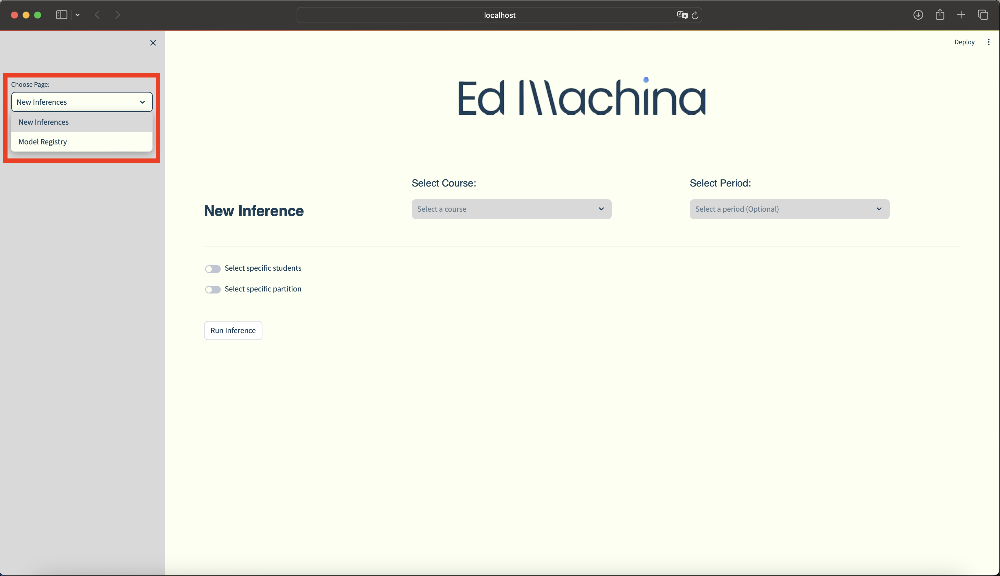

<div align="center">

</div>

&nbsp;
&nbsp;
# ED-ML
The **ed-ml** repository was created to develop the **ed_ml package** that will be leveraged to run the end-to-end Machine Learning challenge presented by EdMachina.

The **ed_ml** package can be used to:
- Run **data processing** jobs
- Run **model tuning** jobs
- Manage a ML model **repository**
- **Serve** models than can be consumed through an endpoint
- Run new **inferences** programatically
- Interact with the solution through a **web-app**


&nbsp;
## Table of Contents
----------------------

- [Installation](#Installation)
- [Usage](#Usage)
- [Workflows](#Workflows)
- [Processes](#Processes)
- [API reference](#APIreference)
- [Testing](#Testing)
- [License](#License)
- [Author](#Author)


&nbsp;
## Installation
----------------------
    
1. Create python virtual environment:
```
python3 -m venv .venv
```
2. Install ed_ml module in "editable" mode:
```
pip install -e .
```
3. Install & run the [Docker Desktop](https://docs.docker.com/engine/install/) application.
4. Set the `DOCKERHUB_TOKEN` environment variable to pull images from the `ed-ml-docker` dockerhub repository:
```bash
export DOCKERHUB_TOKEN=token_value
```


&nbsp;
## Usage
----------------------

### Quick Start

The most straight-forward way to interact with the solution is through the **Streamlit web-app**. To do so, run the following commands:
```
chmod +x ./scripts/bash/run_app.sh
```
```
./scripts/bash/run_app.sh
```

This will run the `run_app.sh` bash script, which will:
- Log in to the `ed-ml-docker` dockerhub repository
- Pull the `model_serving_image_v1.0.0` & `app_image_v1.0.0` docker images
- Run a `model_serving_container_v1.0.0` from the `model_serving_image_v1.0.0` image
  - This will serve the **champion** model leveraging the `flash` library to set up a live **endpoint**
- Run a `app_container_v1.0.0` from the `app_image_v1.0.0` image
  - This will deploy a streamlit web-app to interact with the model & generate new inferences.

Finally, open the web-app through the url: [http://localhost:8501](http://localhost:8501)
&nbsp;

In order to generate new inferences:
- Select the **New Inferences** page
- Select the **Course**
- Select the **Period**
- (Optionally) Choose specific **students**
- (Optionally) Specify the **partition**
- Click the **Run Inference** button
  - You can sort student inferences from least likely to pass the course and viceverse
- (Optionally) Click on the **Download Predictions** button

<div align="center">

</div>
&nbsp;

<div align="center">
  
</div>
&nbsp;

Additionally, the models stored in the **Model Registry** can be examined in the *Model Registry* page:

<div align="center">

</div>

&nbsp;
### Other ways to consume the model
- The `champion` model can be consumed programatically, as follows:

```python
from config.params import Params
from ed_ml.utils.load_data import load_raw_data
import request

USER_UUID='bc281b7f-8c99-40c8-96ba-458b2140953c'
COURSE_UUID='14100057-7f38-4776-a037-279e4f58b729'
PARTICION=44

# Load 
request_df = load_raw_data(
    user_uuids=['bc281b7f-8c99-40c8-96ba-458b2140953c'],
    course_uuids=['14100057-7f38-4776-a037-279e4f58b729'],
    particion=44
)

# Send request
prediction = requests.post(
    Params.request_url, 
    json=request_df.to_dict()
).json()
```
```
{
  'predicted_probability': {
    'bc281b7f-8c99-40c8-96ba-458b2140953c': 0.9960484720758693
  }
}
```


&nbsp;
## Workflows
----------------------


&nbsp;
## Processes
----------------------


&nbsp;
## APIreference
----------------------


&nbsp;
## Testing
----------------------


&nbsp;
## Author
----------------------


`TODO`:
- [ ] Create diagrams
- [ ] Complete README.md
- [x] Add docstrings using copilot
- [ ] add docker image for model


> blockquote

Markdown | Less | Pretty
--- | --- | ---
*Still* | `renders` | **nicely**
1 | 2 | 3

~~The world is flat.~~


Here's a sentence with a footnote. [^1]

[^1]: This is the footnote.


<dl>
  <dt>Definition list</dt>
  <dd>Is something people use sometimes.</dd>
</dl>