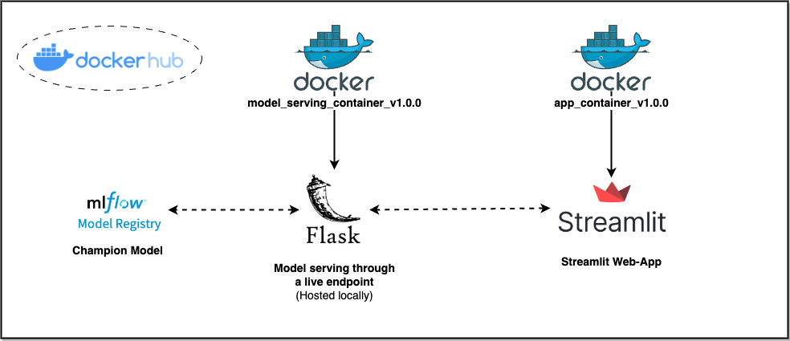
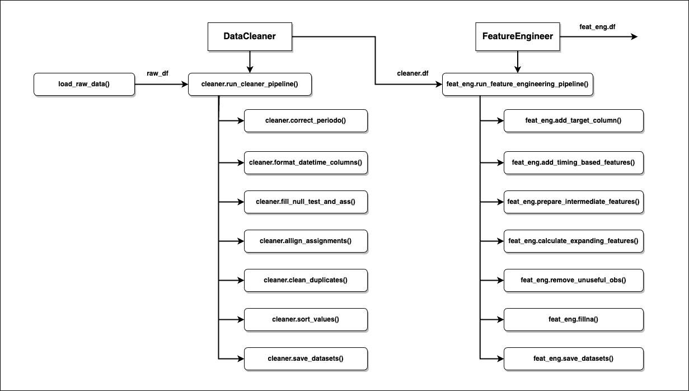

<div align="center">

</div>

&nbsp;
&nbsp;
# ED-ML
The **ed-ml** repository was created to develop the **ed_ml package** that will be leveraged to run the end-to-end Machine Learning challenge presented by EdMachina.

The challenge consists on tackling a classic **unbalanced classification** problem: predicting wether or not a a student will get a passing grade when the course ends.
- *Note that a passing grade is considered as a final grade greater to or equal than 4*.

Thus, the **ed_ml** package was designed to:
- Run **data processing** jobs, that will:
  - Perform data cleaning steps.
  - Define the target.
  - Extraction of meaningful features to build ML classification models.
- Run **model tuning** jobs, that will:
  - Train multiple classification models on a balanced dataset.
  - Select the best performant models, based on the mean cross validation score.
- Manage a ML model **repository**, that will:
  - Track, register & save models, leveraging mlflow.
  - Define production, staging & development models, based on the test score (unbalanced dataset).
    - Note that the evaluation metric can be defined by the user.
- **Serve** a champion model than can be consumed through an endpoint.
  - *Note that the expression "champion model" and "production model" will be used interchangeably throughout the documentation.*
- Run new **inferences** programatically.
- Interact with the solution through a Streamlit **web-app**.


&nbsp;
# Table of Contents

- [Installation](#installation)
- [Usage](#usage)
- [Workflows](#workflows)
- [Processes](#processes)
  - [Data Processing](#data-processing)
  - [Model Tuning](#model-tuning)
  - [Model Updating](#model-updating)
  - [Model Serving](#model-serving)
  - [New Inference](#new-inference)
  - [App Running](#app-running)
- [API reference](#apireference)
  - [DataCleaner](#datacleaner)
  - [FeatureEngineer](#featureengineer)
  - [ModelTuner](#modeltuner)
  - [Model](#model)
  - [MLPipeline](#mlpipeline)
  - [ModelRegistry](#modelregistry)
- [Outputs](#outputs)
- [Configuration and Settings](#configuration-and-settings)
- [Testing](#testing)
- [Next Steps](#next-steps)
- [License](#license)
- [Author](#author)


&nbsp;
# Installation

1. Export GitHub credentials as environment variables:
  - *Note that the ed-ml repository is currently a private repository.*
```bash
export GITHUB_USERNAME=username_value
export GITHUB_TOKEN=token_value
```
2. Clone the GitHub repository:
```
git clone https://github.com/SimonGM97/ed-ml.git
```
3. Create python virtual environment:
```
python3 -m venv .venv
```
4. Install the ed_ml module in "editable" mode:
```
pip install -e .
```
  - *Note that this command will also install the following dependencies, specified in `requirements.txt`:*
```
setuptools==69.0.2
pandas==2.1.3
numpy==1.26.2
scikit-learn==1.3.2 
shap==0.43.0
lightgbm==4.1.0
xgboost==2.0.2
mlflow==2.8.1
hyperopt==0.2.7
imbalanced-learn==0.11.0
flask==3.0.0
pytest==7.4.3
streamlit==1.29.0
watchdog==3.0.0
plotly==5.18.0
openpyxl==3.1.2
psutil==5.9.6
```
5. Install & run the [Docker Desktop](https://docs.docker.com/engine/install/) application.
6. Set the `DOCKERHUB_TOKEN` environment variable to pull images from the `ed-ml-docker` dockerhub repository:
```bash
export DOCKERHUB_USERNAME=username_value
export DOCKERHUB_TOKEN=token_value
```
7. Pull the docker images stored in the `ed-ml-docker` dockerhub repository:
```
chmod +x ./scripts/bash/image_pulling.sh
```
```
./scripts/bash/image_pulling.sh
```
- Note that this will pull the following docker images:
  - `data_processing_image_v1.0.0`
  - `model_tuning_image_v1.0.0`
  - `model_updating_image_v1.0.0`
  - `model_serving_image_v1.0.0`
  - `inference_image_v1.0.0`
  - `run_app_image_v1.0.0`


&nbsp;
# Usage

## Quick Start

The most straight-forward way to interact with the solution is through the **Streamlit web-app**, which has two main *panes*:
  - **New Inferences Pane**: allows users to:
    - Specify the desired filters (i.e.: course, students, partition, etc).
    - Query new inferences for the target population, by sending requests to the champion model endpoint.
    - Visualize a quick summary of the inferences in a donut chart.
    - Download inferences as a csv file.
  - **Model Registry**: allows users to:
    - Visualize a summary table of the *production*, *staging* & *development* models.
    - Inspect any particular model, accessing:
      - Main metrics
      - Confusion Matrix
      - ROC Curves
      - Feature Importances

In order to use the web app, run the following commands:
```
chmod +x ./scripts/bash/run_app.sh
```
```
./scripts/bash/run_app.sh
```

This will run the `run_app.sh` bash script, which will:
- Run a `model_serving_container_v1.0.0` from the `model_serving_image_v1.0.0` image
  - This will serve the **champion** model leveraging the `flask` library to set up a live **endpoint**
- Run a `run_app_container_v1.0.0` from the `run_app_image_v1.0.0` image
  - This will deploy a streamlit web-app to interact with the model & generate new inferences.

<div align="center">

</div>
&nbsp;

Finally, open the web-app through the url: [http://localhost:8501](http://localhost:8501)
&nbsp;

In order to generate new inferences:
- Select the **New Inferences** page
- Select the **Course**
- Select the **Period**
- (Optionally) Choose specific **students**
- (Optionally) Specify the **partition**
- Click the **Run Inference** button
  - You can sort student inferences from least likely to pass the course and viceverse
- (Optionally) Click on the **Download Predictions** button

<div align="center">

</div>
&nbsp;

<div align="center">
  
</div>
&nbsp;

Additionally, the models stored in the **Model Registry** can be examined in the *Model Registry* page:

<div align="center">

</div>
&nbsp;

<div align="center">

</div>
&nbsp;

<div align="center">

</div>
&nbsp;


&nbsp;
## Other ways to consume the model
- The `champion` model can be consumed programatically, by:

1) leveraging the `requests` library:

```python
from config.params import Params
from ed_ml.utils.load_data import load_raw_data
import requests
import numpy as np

COURSE_NAME='Multi-lateral zero-defect productivity'
USER_UUIDS=['bc281b7f-8c99-40c8-96ba-458b2140953c']
PARTICION=44

# Load
request_df = load_raw_data(
    course_name=COURSE_NAME,
    user_uuids=USER_UUIDS,
    particion=44
)

# Send request
prediction = requests.post(
    Params.request_url, 
    json=request_df.replace(np.nan, 'nan').to_dict()
).json()
```
```
{
  'predicted_probability': {
    'bc281b7f-8c99-40c8-96ba-458b2140953c': 0.19705963134765625
  }
}
```

2) Running the `infererence.py` file with the specified parameters. Example:
```
.venv/bin/python scripts/inference/inference.py --course_name "User-friendly intangible flexibility"
```
```
{'predicted_probability': {'2aca9718-523f-4cb5-8b83-ed362699e0fd': 0.015265429392457008,
                           '45b85fed-3d1c-427a-8f4e-7ab70cf429cb': 0.0006170900887809694,
                           '4fe311a2-4649-49fd-b171-14c2a18e16ca': 0.051627274602651596,
                           '5013f8e6-8c5b-4f52-920a-36268204f2d8': 0.001468171481974423,
                           '54b53056-3c55-4795-8798-4b774f049f45': 0.005332855507731438,
                           '66b9ff61-2164-4acc-bac9-8215c30f65df': 0.0011673243716359138,
                           '697ea7e8-a0b2-4ed8-b751-3bccde2d8576': 0.01301568653434515,
                           '81e72199-6a9f-4fdb-8ac7-f313a6373e76': 0.1277814656496048,
                           '980b0cfd-0a45-457a-857c-331a254df172': 0.0006997688324190676,
                           'aa4ccd54-aec8-4c8a-9c6e-9cf7b4c08936': 0.00034668829175643623,
                           'b40f5d96-1612-44a9-94dd-eda9a00879fd': 0.0007899168413132429,
                           'baac0a54-73d6-4187-893b-94b0e344ece0': 0.0002678850432857871,
                           'c8325cfc-89e9-44e7-b795-ff06ae02b8df': 0.009119835682213306,
                           'd62835ea-06b2-4519-83aa-4007a6451194': 0.0014423102838918567,
                           'dd6638dc-9fd3-4c6d-b5a8-f8ef4a969960': 0.002114782342687249,
                           'ef780019-5203-451d-b0c6-4b81cf51b0ad': 0.005512399133294821,
                           'f7cc14ec-4281-45bf-8e60-a28db62eda29': 0.8770778775215149}}
```
3) Running the `inference_container_v1.0.0` from the `inference_image_v1.0.0`. Example:
```
./scripts/bash/run_new_inference.sh course_name user_uuids particion pick_random
```
  - *Note that course_name, user_uuids, particion & pick_random are optional variables that can be passed through the terminal.*

&nbsp;
# Workflows

The main workflow that can be ran with the **ed-ml** repository is the `model_building_workflow`; which is designed to orchestrate the following sequential processes:
- Run a **Data Processing** job
- Run a **Model Tuning**  job
- Run a **Model Updating** job

*Note that each of these processes will be further discussed in the [Processes](#processes) section.*

In order to start the workflow, run the following commands:
```
chmod +x ./scripts/bash/model_building_workflow.sh
```
```
./scripts/bash/model_building_workflow.sh max_evals
```
  - *Note that max_evals is an optional variable that can be passed through the terminal.*

This bash script will run the `docker-compose.yaml` file that will run and orchestrate docker containers from the following docker images:
  - `data_processing_image_v1.0.0` -> `data_processing_container_v1.0.0`
  - `model_tuning_image_v1.0.0` -> `model_tuning_container_v1.0.0`
  - `model_updating_image_v1.0.0` -> `model_updating_container_v1.0.0`


<div align="center">

</div>
&nbsp;

- *Note that the S3 buckets represents future state of the application, as the datasets are currently stored in the local file system.*


&nbsp;
# Processes

In turn, the **ed-ml** repository contains different processes/jobs that can be ran either individually (as docker containers from the docker images stored in the dockerhub repository), or as part of the broader **workflow** detailed above.

## Data Processing

The **Data Processing** job is based on a sequence of data transformation steps, organized to clean raw datasets & extract meaningfull features to aid in the **Modeling** section of the project. As the high level diagram shows, these transformation processes are run by various methods from the `DataCleaning` & `FeatureEngineer` classes:
- load_raw_data (from the *utils* module)
- **[DataCleaning](#datacleaner)**:
  - *run_cleaner_pipeline()*:
    - *correct_period()*
    - *format_datetime_columns()*
    - *fill_null_test_and_ass()*
    - *allign_assignments()*
    - *clean_duplicates()*
    - *sort_values()*
    - *save_datasets()*
- **[FeatureEngineer](#featureengineer)**:
  - *run_feature_engineering_pipeline()*:
    - *add_target_column()*
    - *add_timing_based_features()*
    - *prepare_intermediate_features()*
    - *calculate_expanding_features()*
    - *remove_unuseful_obs()*
    - *fillna()*
    - *save_datasets()*

*For further detail, skip to the [API reference](#api-reference) section.*

<div align="center">

</div>
&nbsp;

These are the schemas of the *raw_df* (*input*) and *FeatureEngineer.df* (*output*):

<div align="center">

</div>
&nbsp;

<div align="center">

</div>
&nbsp;


## Model Tuning

The **Model Tuning** job is designed to find the most performant classification ML models, leveraging hyperopt's TPE based search engine to optimize both the model flavor (or algorithm) & set of hyperparameters in order to train robust models with strong generalization capabilities. As the high level diagram shows, this requires running various methods from the `ModelTuner`, `ModelRegistry`, `MLPipeline` & `Model` classes (while consuming the `df` attribute from the `FeatureEngineer` class):
- **[ModelTuner](#modeltuner)**:
  - *run()*:
    - *objective()*
    - *prepare_parameters()*
    - *find_dev_models()*
    - *evaluate_dev_models()*
    - *save_dev_models()*
- **[ModelRegistry](#modelregistry)**:
  - *set_up_tracking_server()*:
- **[MLPipeline](#mlpipeline)**:
  - *prepare_datasets()*
  - *build_pipeline()*
- **[Model](#model)**:
  - *build()*
  - *evaluate_val()*
  - *fit()*
  - *log_model()*
  - *load_from_registry()*
  - *evaluate_test()*
  - *save()*

*For further detail, skip to the [API reference](#api-reference) section.*

<div align="center">

</div>
&nbsp;

## Model Updating

The **Model Updating** job is designed re-evaluate model performances & re-define model stages in the `ModelRegistry` (i.e.: production, staging & development). This is acheved by:
  - (Optionally) Re-fitting registered models on new train datasets.
  - (Optionally) Optimize model.cutoff attribute (based on F1 Score).
  - Evaluating on new test set & update test performance scores.
  - (Optionally) Re-calculating feature importance.
  - Allowing registered models to compete and re-define model stages based on new test performance.

As the high level diagram shows, this requires running various methods from the `ModelRegistry`, `MLPipeline` & `Model` classes:

- **[ModelRegistry](#modelregistry)**:
  - *update_model_stages()*
  - *clean_registry()*
  - *clean_file_system()*
  - *clean_tracking_server()*
  - *clean_mlflow_registry()*
- **[MLPipeline](#mlpipeline)**:
  - *updating_pipeline()*
- **[Model](#model)**:
  - *fit()*
  - *evaluate_test()*
  - *find_feature_importance()*
  - *save()*

*For further detail, skip to the [API reference](#api-reference) section.*

<div align="center">

</div>
&nbsp;


## Model Serving

The **Model Serving** process is designed to leverage the `flask` library to serve the **champion model** (i.e.: the production model) through a *live endpoint*.
*Note that currently, the endpoint is hosted locally.*

- **[ModelRegistry](#modelregistry)**:
  - *load_model()*
- **[MLPipeline](#mlpipeline)**:
  - *inference_pipeline()*
- **[DataCleaner](#datacleaner)**:
  - *run_cleaner_pipeline()*
- **[FeatureEngineer](#featureengineer)**:
  - *run_feature_engineering_pipeline()*
- **[Model](#model)**:
  - *predict_proba()*

*For further detail, skip to the [API reference](#api-reference) section.*

<div align="center">

</div>
&nbsp;


## New Inference

The **New Inference** is a simple process that sends a request to the endpoint created in the **Model Serving** process, receives a new inference and saves it as a json file.

&nbsp;
## App Running

The **App Running** process will run the locally hosted Streamlit web-app and will:
  - Render required images, tables & plots.
  - Ping the model endpoint, receive & display new inferences.

Functions utilized:
- *build_inference_page():*:
  - *load_raw_data()*
  - *filter_df()*
  - *generate_new_predictions()*
  - *show_results()*:
    - *find_donut_chart()*
    - *data_editor()*
- *build_model_registry_page():*:
  - *find_models()*
  - *show_models_table()*
  - *show_algorithm_fig()*
  - *show_metrics()*
  - *show_performance_plots()*
  - *show_feature_importance_plots()*
  - *show_3d_predictions()*

<div align="center">

</div>
&nbsp;


&nbsp;
# API reference

The processes defined previously require the use of the following classes and methods:

&nbsp;
## DataCleaner

Class for cleaning and preprocessing raw datasets.

### Attributes

- `df`: (pd.DataFrame) Input DataFrame that will be transformed throughout subsequent methods.

### Methods

#### `run_cleaner_pipeline(save: bool = False) -> pd.DataFrame`:

Method that will execute the data cleaning pipeline, which will:
1) Correct period values
2) Format datetime columns
3) Fill values for tests & assignments
4) Clean duplicate observations
5) Alligh assignments, so that assignment creation and assignment submissions are found in the same row
6) Sorts results y user_uuid, course_uuid & particion
7) (optionally) saves intermediate results.

- :param `save`: (bool) Whether to save the cleaned dataset.
- :return: (pd.DataFrame) Cleaned DataFrame.


#### `correct_periodo(df: pd.DataFrame) -> pd.DataFrame`:

Method that corrects column "periodo" so that it only contains valid values.

- :param `df`: (pd.DataFrame) DataFrame with raw "periodo" column.
- :return: (pd.DataFrame) DataFrame with corrected "periodo" column values.


#### `format_datetime_columns(df: pd.DataFrame) -> pd.DataFrame`:

Method that casts datetime columns into datetime objects.

- :param `df`: (pd.DataFrame) DataFrame with raw datetime columns.
- :return: (pd.DataFrame) DataFrame with corrected datetime column types.


#### `fill_null_test_and_ass(df: pd.DataFrame) -> pd.DataFrame`:

Method that will fill null values for tests & assignments, based on the following assumptions:
1) If a user_uuid has a null nota_parcial, then it will be interpreted as the student being absent for the exam; thus the student will be assigned a 0 score for that exam.
2) If a user_uuid has a null assignment score, then it will be interpreted as the student not submitting any material; thus the student will be assigned a 0 score for that assignment.

- :param `df`: (pd.DataFrame) DataFrame with unexpected null values in "nota_parcial" or "score".
- :return: (pd.DataFrame) DataFrame without unexpected null values in "nota_parcial" or "score".


#### `allign_assignments(df: pd.DataFrame) -> pd.DataFrame`:

Method that alligns, on a same row, the assignment creations with their respective assignment submissions, by applying the following steps:
1) Find assignment submissions & assignment creations
2) Corect assignment submissions with it's corresponding assignment creation
3) Concatenate corrected assignments with initial DataFrame
4) Fill assignment creations with no assignment submissions, assuming a 0 score for that assignment.
5) Clean unnecessary assignment creations (repeated observations that have already been matched)

- :param `df`: (pd.DataFrame) DataFrame with missaligned assignment creations & assignment submissions.
- :return: (pd.DataFrame) DataFrame with alligned assignment creations & assignment submissions.


#### `allign_assignments(df: pd.DataFrame) -> pd.DataFrame`:

Function that will correct unexpected duplicate observations, based on the following assumptions:
1) If there is more than one observation for the same user_uuid, course_uuid & nombre_examen, this will be interpreted as a multiple part exam, where the final note (for that exam) is given by the average of the partial submissions.
2) If theere is more thatn one observation for the same user_uuid, course_uuid & ass_name_sum, this will be interpreted as a multiple part assignment, where the final note (for that assignment exam) is given by the average of the partial submissions.

- :param `df`: (pd.DataFrame) DataFrame containing unintended duplicate observations.
- :return: (pd.DataFrame) DataFrame without unintended duplicate observations.


#### `save_dataset() -> None`:
Save the cleaned dataset to a CSV file.


#### `load_dataset() -> None`:
Load the cleaned dataset from a CSV file.


&nbsp;
## FeatureEngineer

Class used to perform feature engineering processes & transformations required to generate ML datasets that will later be consumed by ML models.

### Attributes

- `df`: (pd.DataFrame) Input DataFrame that will be transformed throughout subsequent methods.

### Methods

#### `run_feature_engineering_pipeline(save: bool = False) -> pd.DataFrame`:

Method that executes the feature engineering pipeline, which will:
1) Add target column
2) Calculate timing based features
3) Calculate intermediate features
4) Calculate aggregated features on expanding DataFrame
5) Remove unusefull observations
6) Fill null observations
7) Save engineered dataset

- :param `save`: (bool) Whether to save the cleaned dataset.
- :return: (pd.DataFrame) Cleaned DataFrame.


#### `add_target_column(df: pd.DataFrame) -> pd.DataFrame`:

Method that will produce the target variable by assigning a 0 if the final grade is greater to or equal to 4, and a 1 if that is not the case.
1) Note that, assigning a 1 to the smaller class is best practice on unbalanced classification problems.

- :param `df`: (pd.DataFrame) DataFrame without target column.
- :return: (pd.DataFrame) DataFrame with target column.


#### `add_timing_based_features(df: pd.DataFrame) -> pd.DataFrame`:

Method that will create features realted to the time at which the assignments were unlocked, submitted and due at. The intent is to model & distinguish lazy students that usually prepare and submit assignments
near the deadline; compared to dedicated students that usually submit assignments with time to spare.

Features being created:
1) hrs_to_do_assignment: total hours assigned to do an assignment (from unlock date until due date)
2) hrs_taken_to_do_assignment: number of hours spent by the student to do the assignment (from unlock  date until submittion date)
3) rel_time_taken_to_do_assignment: the number of hours spent working on the exam, relative to the total hours available to do the exam.
4) hrs_before_due: number of spare hours that the student had when submitting the assignment (from submission date until due date).

Note that this method requires the transformation DataCleaner.allign_assignments() to have been ran.

- :param `df`: (pd.DataFrame) DataFrame without timing based features.
- :return: (pd.DataFrame) DataFrame with timing based features.


#### `prepare_intermediate_features(df: pd.DataFrame) -> pd.DataFrame`:

Method that will calculate features required for a more seamingless calculation of cumulative features that will be generated in the self.calculate_expanding_features() method.

Features created:
1) parciales_n: column containing a 1 if the student has taken a 'PRIMER PARCIAL(20)' or 'SEGUNDO PARCIAL(20)' in that partition.
2) nota_parciales: column containing the grade of the 'PRIMER PARCIAL(20)' or 'SEGUNDO PARCIAL(20)' that was obtained in that partition.
3) integradores_n: column containing a 1 if the student has taken a 'INTEGRADOR(30)' exam in that partition.
4) nota_integradores: column containing the grade of the 'INTEGRADOR(30)' that was obtained in that partition.
5) recuperatorios_n: column containing a 1 if the student has taken a 'RECUPERATORIO PRIMER PARCIAL(20)' or 'RECUPERATORIO SEGUNDO PARCIAL(20)' in that partition.
6) nota_recuperatiorios: column containing the grade of the 'RECUPERATORIO PRIMER PARCIAL(20)' or 'RECUPERATORIO SEGUNDO PARCIAL(20)' that was obtained in that partition.
7) overall_parciales_n: column containing a 1 if the student has taken any exam in that partition.
8) assignment_n: column containing a 1 if the student has submitted any assignment in that partition.
9) assignment_zero: column that reflect if an assignment was graded with a 0.

- :param `df`: (pd.DataFrame) DataFrame without intermediate features.
- :return: (pd.DataFrame) DataFrame with intermediate features.


#### `prepare_intermediate_features(df: pd.DataFrame) -> pd.DataFrame`:

Method that will calculate aggregated features on an expanding DataFrame. This is designed so that the 
value of a feature calculated at a particular partition, is considering all information upto that 
partition.

Applied Transformations:
1) Exam related engineered features
  - parciales_n:
    - sum: count of exams taken, until that partition
  - nota_parciales: 
    - min: minimum grade obtained in an exam, until that partition.
    - max: maximum grade obtained in an exam, until that partition.
    - mean: mean grade obtained in an exam, until that partition.
    - std: standard deviation of grades obtained in an exam, until that partition.
  - integradores_n: 
    - sum: count of integradores taken, until that partition
  - nota_integradores:
    - min: minimum grade obtained in an integrador exam, until that partition.
    - max: maximum grade obtained in an integrador exam, until that partition.
    - mean: mean grade obtained in an integrador exam, until that partition.
    - std: standard deviation of grades obtained in an integrador exam, until that partition.
  - recuperatorios_n:
    - sum: count of make-up exams taken, until that partition.
  - nota_recuperatorios:
    - min: minimum grade obtained in a make-up exam, until that partition.
    - max: maximum grade obtained in a make-up exam, until that partition.
    - mean: mean grade obtained in a make-up exam, until that partition.
    - std: standard deviation of grades obtained in a make-up exam, until that partition.
  - overall_parciales_n:
    - sum: count of all kinds of exams taken, until that partition.
  - nota_overall:
    - min: minimum grade obtained on all exams taken, until that partition.
    - max: maximum grade obtained on all exams taken, until that partition.
    - mean: mean grade obtained on all exams taken, until that partition.
    - std: standard deviation of grades obtained on all exams taken, until that partition.

2) Assignment related engineered features
  - assignment_n:
    - sum: count of all assignments submitted, until that partition.
  - score:
    - min: minimum grade obtained on all assignments submitted, until that partition.
    - max: maximum grade obtained on all assignments submitted, until that partition.
    - mean: mean grade obtained on all assignments submitted, until that partition.
    - std: standard deviation of grades obtained on all assignments submitted, until that 
      partition.
  - assignment_zero:
    - sum: count of all assignments submitted which were graded with a 0, until that partition.

3) Time related engineered features
  - hrs_to_do_assignment:
    - min: minimum available hours to complete an assignment, until that partition.
    - max: maximum available hours to complete an assignment, until that partition.
    - mean: mean available hours to complete an assignment, until that partition.
    - std: standard deviation of available hours to complete an assignment, until that partition.
  - hrs_taken_to_do_assignment:
    - min: minimum hours taken to complete an assignment, until that partition.
    - max: maximum hours taken to complete an assignment, until that partition.
    - mean: mean hours taken to complete an assignment, until that partition.
    - std: standard deviation of hours taken to complete an assignment, until that partition.
  - rel_time_taken_to_do_assignment:
    - min: minimum relative time taken to complete an assignment, until that partition.
    - max: maximum relative time taken to complete an assignment, until that partition.
    - mean: mean relative time taken to complete an assignment, until that partition.
    - std: standard deviation of the relative time taken to complete an assignment, until that partition.
  - hrs_before_due:
    - min: minimum number of spare hours that the student had when submitting an assignment, until that partition.
    - max: maximum number of spare hours that the student had when submitting an assignment, until that partition.
    - mean: mean number of spare hours that the student had when submitting an assignment, until that partition.
    - std: standard deviation of the number of spare hours that the student had when submitting an assignment, until that partition.

- :param `df`: (pd.DataFrame) DataFrame without expanding features.
- :return: (pd.DataFrame) DataFrame with expanding features.


#### `remove_unuseful_obs(df: pd.DataFrame) -> pd.DataFrame`:

Method that will remove partitions until the first exam was taken and the first assignment was submitted.
The reason for removing observations until this point is so that ML models will have at least some useful information to make inferences & understand patterns.

- :param `df`: (pd.DataFrame) DataFrame containing "unuseful" observations.
- :return: (pd.DataFrame) DataFrame without "unuseful" observations.


#### `save_dataset() -> None`:
Save the engineered dataset to a CSV file.


#### `load_dataset() -> None`:
Load the engineered dataset from a CSV file.


&nbsp;
## ModelTuner

Class designed to find the most performant classification ML models, leveraging hyperopt's TPE based search engine to optimize both the model flavor (or algorithm) & set of hyperparameters in order to train robust models with strong generalization capabilities.

### Attributes

- `algorithms`: (list) Model flavors to iterate over. 
  - Currently available options: random_forest, lightgbm, xgboost.
- `eval_metric`: (str) Name of the metric utilized to evaluate ML models over the validation set.
  - Note: this is also the metric which will be optimized by the TPE algorithm.
- `val_splits`: (int) Number of splits utilized in for cross validation of ML model candidates.
- `train_test_ratio`: (float) Proportion of data to keep as the test set; relative to the complete dataset.
- `n_candidates`: (int) Number of development models that will be chosen as potential candidates.
- `local_registry`: (bool) Wether or not to load models from the file system or MLflow Model Registry.
- `max_evals`: (int) Number of maximum iterations that the hyperopt.fmin() function will be allowed to search before finding the most performant candidates.
- `timeout_mins`: (int) Number of minutes that the hyperopt.fmin() function will be allowed to run before finding the most performant candidates.
- `loss_theshold`: (float) Theshold performance at which, if reached, the optimization algorithm will sease searching for a better model.
- `min_performance`: (float) Minimum performance required for a candidate model to be logged in the mlflow tracking server.
- `search_space`: (dict) Hyperparameter search space.
- `ml_pipeline`: (MLPipeline) Instance of MLPipeline.
- `model_registry`: (ModelRegistry) Instance of ModelRegistry.
- `dev_models`: (List[Model]): Development models found by the hyperopt search engine.


### Methods

#### `run(ml_df: pd.DataFrame, balance_train: bool = True, balance_method: str = 'SMOT', use_warm_start: bool = True, soft_debug: bool = False, deep_debug: bool = False) -> None`:

Main method that orchestrates the processes required to track, train and evaluate performant development models.
This method will:
1) Set up the mlflow tracking server (currently hosted locally).
2) Define a balanced training set (which will be later divided in the cross validation section).
3) Define a test set (unbalanced, in order to accurately depict the real group distributions).
4) (Optional) Set up a "warm start" for the search engine, leveraging a performant solution found on a previous run.
  - Note: utilizing warm start will find performant solutions potentially from the first iteration, but the search algorithm is predisposed to find local minima.
5) Run the hyperopt's TPE based search engine.
6) Load the most performant development models, based on the mean cross validation score (on the validation set).
7) Evaluate the development models on the unbalanced test set.
8) Save development models.

- :param `ml_df`: (pd.DataFrame) Engineered DataFrame outputted by the FeatureEngineer class.
- :param `balance_train`: (bool) Wether or not to balance train datasets.
- :param `balance_method`: (str) Methodology utilized to balance train datasets.
- :param `use_warm_start`: (bool) Wether or not to utilize the optional warm start functionality.
- :param `soft_debug`: (bool) Wether or not to show general intermediate logs for debugging purposes.
- :param `deep_debug`: (bool) Wether or not to show intermediate logs in the objective function, for debugging purposes.


#### `prepare_parameters(parameters: dict, debug: bool = False) -> dict`:

Method designed to standardize the structure, complete required keys and interpret values of the set of parameters & hyperparameters that are being searched by the hyperopt TPE powered seach engine.

- :param `parameters`: (dict) Parameters with raw structure, uncomplete keys & uninterpreted values.
- :param `debug`: (bool) Wether or not to show input and output parameters for debugging purposes.

- :return: (dict) Parameters with standardized structure, complete keys & interpreted values.


#### `objective(parameters: dict, debug: bool = False) -> dict`:

Method defined as the objective function for the hyperopt's TPE based search engine; which will:
1) Standardize, complete & interprete inputed parameters
2) Leverage MLPipeline to build a ML classification model with the inputed parameters
3) Log the resulting model in the mlflow tracking server, if the validation performance is over a defined threshold.
4) Output the validation performance (mean cross validation score) as the loss function.

- :param `parameters`: (dict) Parameters with raw structure, uncomplete keys & uninterpreted values.
- :param `debug`: (bool) Wether or not to show intermediate logs for debugging purposes.

- :return: (dict) Loss function with the validation performance of the ML classification model.


#### `find_dev_models() -> None`:

Method that finds the most performant development models built by the search engine, by:
1) Querying the top mlflow tracking server runs for each model flavor/algorithm, based on the mean cross validation score.
2) Deleting unperformant runs from the tracking server.
3) Add found dev models to local registry and save changes made.


#### `evaluate_dev_models(debug: bool = False) -> None`:

Method that evaluates the development models on the test set, defined in the MLPipeline.

- :param `debug`: (bool) Wether or not to show self.dev_models performances logs for debugging purposes.


#### `save_dev_models() -> None:`

Method that will save development models in:
1) Tracking server
2) File system


&nbsp;
## Model

Class designed to homogenize the methods for building, evaluating, tracking & registering multiple types of ML classification models with different flavors/algorithms & hyperparameters, in a unified fashion. 

### Attributes

- `model_id`: (str) ID to tag & identify a Model instance.
- `artifact_uri`: (str) URI required to load a pickled model from the mlflow tracking server.
- `version`: (int) Model version, which increases by one each time the model gets re-fitted.
- `stage`: (str) Model stage, which can be either "development", "staging" or "production".
- `algorithm`: (str) Also known as model flavor. Current options are "random_forest", "lightgbm" & "xgboost".
- `hyper_parameters`: (dict) Dictionart containing key-value pairs of the model hyper-parameters.
- `cutoff`: (float) Probability threshold utilized within the `model.predict()` method to infer if a new observation is assigned a class 1.
- `model`: (RandomForestClassifier or XGBClassifier or LGBMClassifier) ML classifier instance.
- `fitted`: (bool) Wether or not a model instance have been fitted.
- `f1_score`: (float) F1 test score.
- `precision_score`: (float) Precision test score.
- `recall_score`: (float) Recall test score.
- `roc_auc_score`: (float) Roc auc test score.
- `accuracy_score`: (float) Accuracy test score.
- `confusion_matrix`: (np.ndarray) Confusion matrix with TP, FP, TN, FN values.
- `fpr`: (np.ndarray) False Positive Rate at each threshold. 
- `tpr`: (np.ndarray) True Positive Rate at each threhold. 
- `thresholds`: (np.ndarray) Thresholds for the FRP & TPR. 
- `cv_scores`: (np.ndarray) Cross validation scores.
- `test_score`: (float) Main evaluation metric for test score.
- `feature_importance_df`: (pd.DataFrame) Feature Importance DataFrame.
- `importance_method`: (str) Name of the method used to calculate feature importance.
- `shap_values`: (np.ndarray) Shapley values for the test observartions.

### Properties (Can be accessed as attributes)

- `warm_start_params`: (dict) Defines the parameters required for a warm start on the ModelTuner.run() method.
- `metrics`: (dict) Defines the test and validation metrics to be logged in the mlflow tracking server.
- `artifacts`: (dict) Defines the dictionary of attributes to be saved as artifacts in the mlflow tracking server.
- `tags`: (dict) Defines the tags to be saved in the mlflow tracking server.
- `val_score`: (np.ndarray) Defines the validation score as the mean value of the cross validation results.
- `run_id`: (str) Finds the run_id, which is accessed throughout the self.artifact_uri.
- `file_name`: (str) Defines the file name in which to save the self.model in the file system.
- `model_name`: (str) Defines the model name used in the mlflow tracking server and mlflow model registry.   

### Methods

#### `correct_hyper_parameters(hyper_parameters: dict, debug: bool = False) -> dict`:

Method that completes pre-defined hyperparameters.

- :param `hyper_parameters`: (dict) hyper_parameters that might not contain pre-defined hyperparameters.
- :param `debug`: (bool) Wether or not to show output hyper_parameters for debugging purposes.

- :return: (dict) hyper_parameters containing pre-defined hyperparameters.


#### `build(debug: bool = False) -> None`:

Method to instanciate the specified ML classification model, based on the model flavor/alrorithm & hyper-parameters.

- :param `debug`: (bool) Wether or not to show output hyper_parameters for debugging purposes.


#### `fit(y_train: pd.DataFrame = None, X_train: pd.DataFrame = None) -> None`:

Method to fit self.model.

- :param `y_train`: (pd.DataFrame) Binary & balanced train target.
- :param `X_train`: (pd.DataFrame) Train features.


#### `predict(X: pd.DataFrame) -> np.ndarray:`

Method for realizing new category inferences, based on the cutoff and the predicted probability.

- :param `X`: (pd.DataFrame) New features to make inferences on.
- :param `cutoff`: (float) Probability threshold at which to infer a class 1.
  - Note: if None, cutoff is set to the self.cutoff value.

- :return: (np.ndarray) New category inferences.


#### `predict_proba(X: pd.DataFrame) -> np.ndarray`:

Method for realizing new probabilistic inferences.

- :param `X`: (pd.DataFrame) New features to make inferences on.

- :return: (np.ndarray) New probabilistic inferences.


#### `evaluate_val(y_train: pd.DataFrame, X_train: pd.DataFrame, eval_metric: str, splits: int, debug: bool = False) -> None`:

Method that will define a score metric (based on the eval_metric parameter) and will leverage the cross validation technique to obtain the validation scores.

- :param `y_train`: (pd.DataFrame) binary & balanced train target.
- :param `X_train`: (pd.DataFrame) Train features.
- :param `eval_metric`: (str) Metric to measure on each split of the cross validation.
- :param `splits`: (int) Number of splits to perform in the cross validation.
- :param `debug`: (bool) Wether or not to show self.cv_scores, for debugging purposes.


#### `evaluate_test(y_test: pd.DataFrame, X_test: pd.DataFrame, eval_metric: str, debug: bool = False) -> None`:

Method that will predict test set values and define the following test metrics:
1) self.f1_score
2) self.precision_score
3) self.recall_score
4) self.roc_auc_score
5) self.accuracy_score
6) self.test_score (utilized to define champion model)

- :param `y_test`: (pd.DataFrame) Binary & un-balanced test target.
- :param `X_test`: (pd.DataFrame) Test features.
- :param `eval_metric`: (str) Metric utilized to define the self.test_score attribute.
- :param `debug`: (bool) Wether or not to show self.test_score, for debugging purposes.


#### `optimize_cutoff(y_test: pd.DataFrame, X_test: pd.DataFrame) -> None`:

Method that will iteratively loop over different cutoff configurations in order to find the most optimal one.

- :param `y_test`: (pd.DataFrame) Binary & un-balanced test target.
- :param `X_test`: (pd.DataFrame) Test features.


#### `find_feature_importance(X_test: pd.DataFrame, debug: bool = False) -> None`:

Method that utilizes the shap library to calculate feature impotances on the test dataset (whenever possible).

- :param `test_features`: (pd.DataFrame) Test features.
- :param `find_new_shap_values`: (bool) Wether or not to calculate new shaply values.
- :param `debug`: (bool) Wether or not to show top feature importances, for debugging purposes.


#### `save(self) -> None`:

Method used to save the Model attributes on file system, mlflow tracking server and mlflow model registry.


#### `save_to_file_system(self) -> None`:

Method that will save Model's attributes in file system.


#### `log_model(self) -> None`:

Method that will log the following attributes on mlflow tracking server:
- self.model
- self.hyper_parameters
- self.metrics
- self.artifacts
- self.tags


#### `register_model(self) -> None`:

Method that will register the model in the mlflow model registry. It will additionally set the tags, current version and current stage.


#### `load_from_file_system(self) -> None`:

Method that will load model attributes from the file system.


#### `load_from_registry(load_model_from_tracking_server: bool = False) -> None`:

Method that will load tags, parameters, metrics and artifacts from the mlflow tracking server, and will load self.model from the mlflow model registry (if specified).

- :param `load_model_from_tracking_server`: (bool) Wether or not to load self.model from the mlflow tracking server or the model registry.


&nbsp;
## MLPipeline

Class designed to standardize the main modelling processes:
- Preparing machine learning datasets.
- Running a model building pipeline.
- Running an inference pipeline.
- Running an model updating pipeline.

### Attributes

- `X_train`: (pd.DataFrame) Train features.
- `X_test`: (pd.DataFrame) Test features.
- `y_train`: (pd.DataFrame) Train target.
- `y_test`: (pd.DataFrame) Test target.

### Methods

#### `prepare_datasets(ml_df: pd.DataFrame, train_test_ratio: float, balance_train: bool = True, balance_method: str = 'SMOT', save: bool = True, debug: bool = False) -> None`:

Method that will prepare machine learning datasets, by:
1) Randomly selecting train & test datasets.
2) Balancing the train datasets (X_train & y_train) with an oversampling technique

Note that the test datasets (X_test & y_test) are purposely kept unbalanced to more accurately depict the real life group proportions; thus achieving a better estimate of the model performance in a production environment. 

- :param `ml_df`: (pd.DataFrame) Engineered DataFrame outputted by the FeatureEngineer class.
- :param `train_test_ratio`: (float) Proportion of data to keep as the test set; relative to the complete dataset.
- :param `balance_train`: (bool) Wether or not to balance train datasets.
- :param `balance_method`: (str) Methodology utilized to balance train datasets.
- :param `save`: (bool) Wether or not so save ML datasets in file system.
- :param `debug`: (bool) Wether or not to show dataset balances for debugging purposes.


#### `build_pipeline(ml_params: dict, eval_metric: str, splits: int, debug: bool = False) -> Model`:

Method that will run the model building pipeline, by:
1) Instanciateing the model.
2) Evaluating the cross validation score over the train datasets.
3) Re-fit the model with the complete train datasets.

- :param `ml_params`: (dict) Parameters required when instanciating the Model class.
- :param `eval_metric`: (str) Name of the metric utilized to evaluate ML model over the validation set.
- :param `splits`: (int) Number of splits utilized in for cross validation of ML model.
- :param `debug`: (bool) Wether or not to show intermediate results, for debugging purposes.

- :return: (Model) Fitted Model instance.


#### `inference_pipeline(model: Model, raw_df: pd.DataFrame) -> dict`:

Method that will run the inference pipeline, by:
1) Cleaning new raw datasets.
2) Calculating engineered datasets.
3) Extracting a new X dataset.
4) Performing new probabilistic predictions.

- :param `model`: (Model) Instance from class Model utilized to infer new predictions.
- :param `raw_df`: (pd.DataFrame) New raw observations to make inferences on.


#### `def updating_pipeline(model: Model, eval_metric: str, refit_model: bool = False, optimize_cutoff: bool = True, find_new_shap_values: bool = False) -> Model`:

Method that will run the model updating pipeline, by:
1) (Optionally) Re-fitting model on new train datasets.
2) (Optionally) Optimize model.cutoff attribute (based on F1 Score).
3) Evaluating model on test set & update test performance scores.
4) (Optionally) Re-calculating feature importance.

- :param `model`: (Model) Instance from class Model that will be updated.
- :param `eval_metric`: (str) Name of the metric utilized to evaluate ML model over the test set.
- :param `refit_model`: (bool) Wether or not to re-fit the inputed model with train datasets.
- :param `optimize_cutoff`: (bool) Wether or not to optimize model.cutoff attribute (based on F1 Score).
- :param `find_new_shap_values`: (bool) Wether or not to calculate new shaply values.


#### `updating_pipeline(model: Model, eval_metric: str, refit_model: bool = False) -> Model`:

Method that will run the model updating pipeline, by:
1) (Optionally) Re-fitting model on new train datasets.
2) Evaluating model on test set & update test performance scores.
3) (Optionally) Re-calculating feature importance.

- :param `model`: (Model) Instance from class Model that will be updated.
- :param `eval_metric`: (str) Name of the metric utilized to evaluate ML model over the test set.
- :param `refit_model`: (bool) Wether or not to re-fit the inputed model with train datasets.
- :param `find_new_shap_values`: (bool) Wether or not to calculate new shaply values.


#### `save_datasets(self) -> None`:

Method that will save ML datasets to file system.


#### `load_datasets(self) -> None`:

Method that will load ML datasets from file system.


&nbsp;
## ModelRegistry

Class designed to organize, manage & update model repositories in a centralized fashion. This includes:
- Tracking of development models throughout the mlflow tracking server.
- Registry of staging & production models in the mlflow model registry.
- Saving models in the file system (for backup purposes)

### Attributes

- `local`: (bool) Wether or not to utilize the file system to load development, staging & production models.
- `local_registry`: (Dict[str, List[str]]) Dictionary with model IDs for development, staging & production models.

### Properties

- `dev_models`: (List[Model]) Method for loading development models.
- `staging_models`: (List[Model]) Method for loading staging models.
- `prod_model`: (Model) Method for the production model.

### Methods

#### `load_models(model_ids: List[str] = None, stage: str = 'development') -> List[Model]`:

Method that will load specified models.

- :param `model_ids`: (List[str]) Model IDs that will be loaded.
  - Note that this is only required for loading models from the file system.
- :param `stage`: (str) Stage from which to load models from.
  - Note that this is only required for loading models from the mlflow model registry/tracking server.

- :return: (List[Model]) List of Model instances with the loaded models.


#### `set_up_tracking_server(self) -> None`:

Method that will locally host the mlflow tracking server on port 5050, for experiment tracking.


#### `register_models(self) -> None`:

Method that will register staging & production models on the mlflow model registry.


#### `update_model_stages(n_candidates: int, update_champion: bool = True) -> None`:

Method that will re-define model stages, applying the following logic:
1) Top n development models will be promoted as "staging" models (also referred as "challenger" models), based on their mean cross validation performance.
2) The top staging model will compete with the production model (also referred as "champion" model), based on their test performance.

- :param `n_candidates`: (int) Number of total challenger models whose test performance will be compared in order to determine the champion model.
  - Note that overly increasing this number might eventually lead to overfitting on the test set.
- :param `update_champion`: (bool) Wether or not to allow for competition of challenger and champion models.
  - If true, a challenger model could potentially be promoted to champion (production) status.


#### `clean_registry(self) -> None`:

Method that will remove any "inactive" model or experiment from the file system, mlflow tracking server and mlflow model registry.
An "inactive" model is defined as a model that cannot be tagged to any current development, staging or production model.


#### `save_local_registry(self) -> None`:

Method that will save the self.local_regisry attribute in the file system.


&nbsp;
# Outputs

The main output that are generated by the **ed_ml** package are the new **inferences** that are obtained programatically; either by running the `Download Predictions` button in the Streamlit web-app, of by running the `inference.py` script through the `inferece_container_v1.0.0` container that is ran from the `inference_image_v1.0.0 image`.
- In the Streamlit web app case, the inferences are saved as .csv files that are automatically downloaded to the `downloads` folder in the user computer.
- In case of running the `inference.py` script (either directily, or as a docker container), the results are saved in `./data_lake/inferences/course_name/particion/date_inferences.json`.


&nbsp;
# Configuration and Settings

The **ed-ml** repository contains a `config` module with a `config.ini` file which contains the user defined configurations for running specific processes throughout the **ed_ml** package.

Current available configurations are as follows:
- **Versioning**:
  - *version*: docker image version.

- **DataProcessing**:
  - *raw_data_path*: path to save raw datasets on.
  - *cleaned_data_path*: path to save cleaned datasets on.
  - *ml_data_path*: path to save engineered datasets on.

  - *target_column*: name of the target column.
  - *datetime_columns*: list of raw DataFrame columns to parse as datetime.

- **Modeling**:
  - *model_attr_path*: path to save Model attributes on.
  - *pipeline_data_path*: path to save ML datasets on.

  - *balance_train*: Wether or not to balance training datasets.
  - *balance_method*: Method chosen to balance train datasets.
  - *class_weight*: Weights for each class (class 1 & 0).
    - *Note that class 1 (i.e.: students fails) should be weighted higher than their counterpart.*

  - *cutoff*: Probability threshold utilized within the `model.predict()` method (from the `Model` class) to infer if a new observation will classified as "Pass" or "Fail".
    - Notes:
      - Decreasing this number will make the model to predict more classes 1 (i.e.: more *fail* students).
      - This number can be optimized using the `model.optimize_cutoff()`, based on the f1_score.

  - *algorithms*: machine learning algorithms/model flavors to try during the ModelTuning section.
  - *eval_metric*: evaluation metric utilized to pick the top performant models (both in validation and test sets).
  - *val_splits*: number of splits to perform over the cross validation section.
  - *train_test_ratio*: percentage of rows to keep as the test set.
  - *n_candidates*: number of model canidates that will be allowed to compete while searching for a production model.
  - *max_evals*: maximum evaluation rounds that the hyperopt.fmin algorithm will loop until converging on a final solution.
  - *timeout_mins*: maximum number of minutes that are allowed to run (in total) in hyperopt.fmin.
  - *loss_threshold*: maximum performance allowed for hyperopt.fmin. If there is a solution with better performance, then the algorithm will sease (and define that as the best solution).
  - *min_performance*: minimum performance required for a development model to be logged in the mlflow tracking server.

- **Mlflow**:
  - *tracking_url*: url required for the mlflow tracking server.
  - *local_registry*: Wether or not to load models from memory of from the mlflow model registry / tracking server.
  - *local_registry_path*: path pointing to the local_registry.json where the model_ids are stored.
  - *artifacts_path*: path to where model artifacts can be initially stored.
  - *experiment_name*: mlflow experiment name. Required for tracking new runs.

- **Inference**:
  - *request_url*: url utilized to send new requests and receive new inferences from the served model.
  - *inference_path*: path to save the new inferences into.

- **Updating**:
  - *refit_model*: Wether or not to re-fit a model when performing a model update.
  - *find_new_shap_values*: Wether or not to re-calculate new shaply values when performing a model update.
  - *optimize_cutoff*: Wether or not to optimize `model.cutoff` attribute, based on the F1 score.

- **Default**:
  - *raw_df*: default value for raw_df parameter.
  - *save*: default value for save parameter.
  - *course_name*: default value for course_name parameter.
  - *user_uuids*: default value for user_uuids parameter.
  - *particion*: default value for particion parameter.
  - *pick_random*: default value for pick_random parameter.


&nbsp;
# Testing

There currently exists two groups of *unit tests* that can be ran programatically before merging two branches or commiting major changes:

- Data Processing Unit Tests:
  - `TestDataProcessing.test__data_processor__success_raw_data_transformed_as_expected()`: Testing method that will validate that a mocked raw dataset is transformed as expected.
- Model Pipeline Unit Tests:
  - `TestMLPipeline.test__ml_pipeline__success_datasets_are_correctly_balanced`: Testing method that will verify that:
    - Train datasets created by the MLPipeline are balanced (i.e.: has approximately 50% observations of each group).
    - Test datasets contain the same unbalanced group distribution as the overall (train & test) datasets.
  - `TestMLPipeline.test__ml_pipeline__inferences_are_consistent`: Method that will validate that new inferences being made to a mocked raw df are consistent with the expected inference.

These can be run programatically through the following command:
```
# Run Data Processing Tests
python3 -m unittest test/test_data_processing.py
```
```
# Run MLPipeline Tests
python3 -m unittest test/test_ml_pipeline.py
```

&nbsp;
# Next Steps

The current version of the **ed-ml** repository relies on multiple locally hosted components. Although this is alligned with the initial purpose of the project, it has inherent limitations. Some of these limitations are:
  - Unable to easily cooperate in a dev environment with a team of multiple engineers.
  - Limitations in the storage space (from the file system).
  - Unable to post a globally accessible model endpoint.
  - Unable to properly scale as inference demand increases.
  - Limited computational capacity while performing data processing & model tuning proceses.

Therefore, the main next steps are centered in leverage multiple cloud services to scale up the availability, storage & performance of the solution:

- [ ] Utilize Redshift as a data warehouse.
- [ ] Utilize S3 for object-based storage (data lake).
- [ ] Increase the ammount of observations utilized for training models.
- [ ] Add exogenous variables. Ideally, external information about the student.
- [ ] Leverage Sagemaker pipelines for DataProcessing, Hyper-parameter Tunning & Model updating jobs.
- [ ] Work with Pyspark for big data processing (data extraction, data cleaning & feature engineering).
- [ ] Experiment with deep learning approaches.
  - Experiment with Convolutional Neural Networks.
  - Consider tuning pre-trained [huggingface](https://huggingface.co/) models.
- [ ] Leverage SageMaker for champion model deployment (i.e.: model serving).
  - Allow auto-scaling, adjust as traffict increases.
- [ ] Leverage SageMaker for Model Monitoring and drift detection.
- [ ] Deploy your Streamlit app on an EC2 instance.
- [ ] Utilize remote mlflow tracking server.
- [ ] Add additional unit tests, integration tests & functional tests.
  - Utilize these as part of the CI/CD pipeline.


&nbsp;
# License

Proprietary License.

This software is proprietary and confidential. The author and copyright holder of this software is Simn Pedro Garca Morillo.

Permission is hereby granted to use and review the source code solely for the purpose of understanding its implementation. Any other use, reproduction, distribution, or modification of this software, in whole or in part, without the explicit written consent of Simn Pedro Garca Morillo, is strictly prohibited.

No license, whether express or implied, is granted for any other purpose or to any other person.

For inquiries regarding licensing or use of this software, please contact simongmorillo1@gmail.com.

 2023 Simn Pedro Garca Morillo


&nbsp;
# Author

- *Name:* Simn Pedro Garca Morillo.
- *GitHub:* [https://github.com/SimonGM97](https://github.com/SimonGM97)
- *Linkedin:* [https://www.linkedin.com/in/simonpgarciamorillo/](https://www.linkedin.com/in/simonpgarciamorillo/)
- *Email:* simongmorillo1@gmail.com
